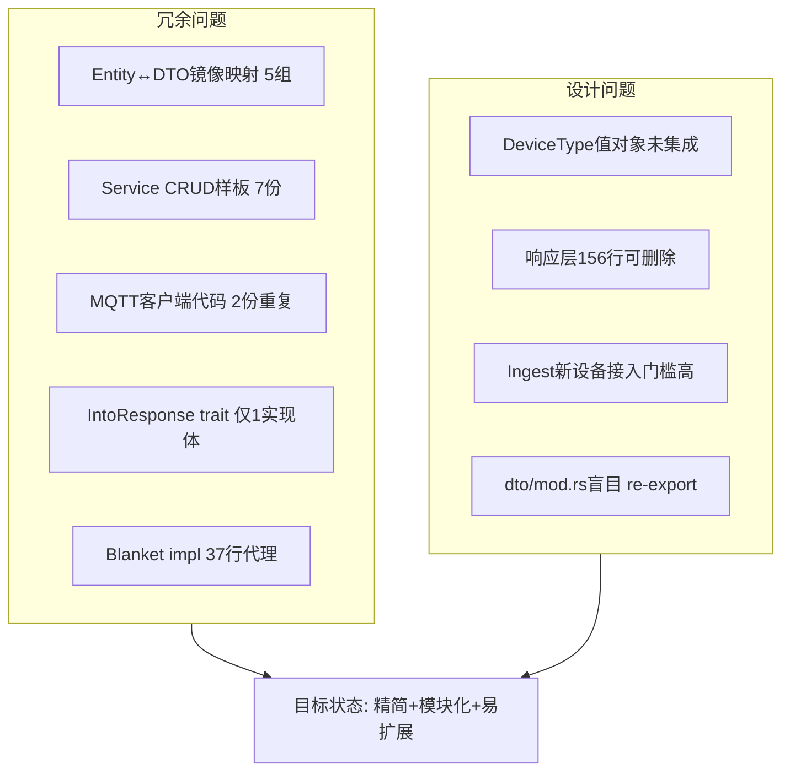
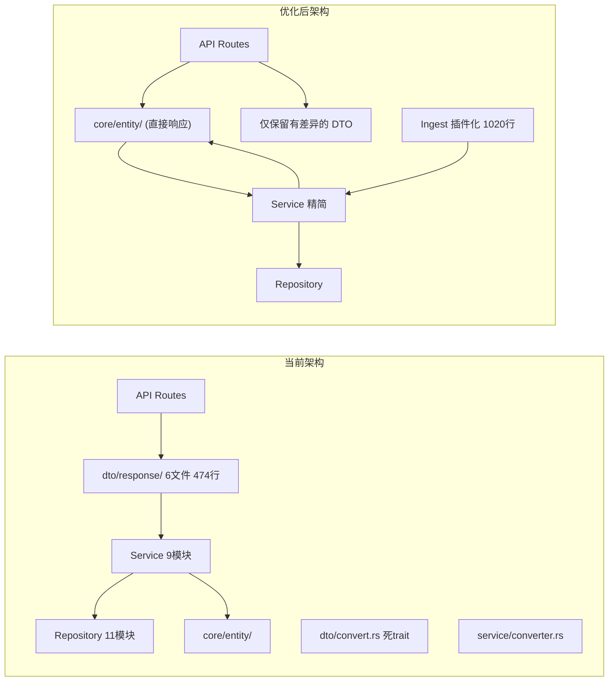

# 第二阶段优化分析报告 v2（激进简化版）

> 基于全量代码审查，目标：**大幅削减冗余、极致简化架构、真正插件化的 Ingest 层**。
> 核心理念：Entity 即 Response，DTO 层只保留不可消除的结构差异。

---

## 1. 当前架构问题全景



---

## 2. 激进简化方案

### P2-1: 消灭响应 DTO 层 (Entity-as-Response 全面化)

**核心思路**: 凡是字段与 Entity 完全相同的 Response DTO，直接删除，Entity 加 `ToSchema` 后自描述。

#### 2.1 可直接删除的 DTO（5个结构体完全消失）

| DTO | 对应 Entity | 字段差异 | 操作 |
|-----|------------|---------|------|
| `RoleResponse` | `Role` | 0 | **删除**，Entity 加 `ToSchema` |
| `ModuleResponse` | `Module` | 0 | **删除**，Entity 加 `ToSchema` |
| `AuditLogResponse` | `AuditLog` | 0 | **删除**，Entity 加 `ToSchema` |
| `PatientResponse` | `Patient` | 0 | **删除**，Entity 加 `ToSchema` |
| `BindingResponse` | `Binding` | 0 | **删除**，Entity 加 `ToSchema` |

#### 2.2 需保留但精简的 DTO

| DTO | 保留原因 | 精简方案 |
|-----|---------|---------|
| `DeviceResponse` | 含 `current_binding: Option<BindingInfo>` | 保持，但删除 `From<Device>`（改为手动构建） |
| `UserResponse` | 含 `role_name: String`（DB关联） | 保持，删除 `IntoResponse` trick |
| `PatientProfileResponse` | 缺少 `created_at/updated_at` | 保持，精简字段 |
| `PatientDetailResponse` | 包含 Patient+Profile 两层 | 保持 |
| `RawDataRecordResponse` | 含 `payload_preview` 运行时计算 | 保持 |
| `RawDataDetailResponse` | 含 base64/hex 编码 | 保持 |

#### 2.3 可删除的 From 实现（5个共 ~50行）

| 文件 | 行号 | 代码 |
|------|------|------|
| [`src/service/admin.rs:264`](src/service/admin.rs:264) | 12行 | `From<Role> for RoleResponse` |
| [`src/service/admin.rs:277`](src/service/admin.rs:277) | 12行 | `From<Module> for ModuleResponse` |
| [`src/service/admin.rs:291`](src/service/admin.rs:291) | 17行 | `From<AuditLog> for AuditLogResponse` |
| [`src/service/patient.rs:250`](src/service/patient.rs:250) | 10行 | `From<Patient> for PatientResponse` |
| [`src/service/binding.rs:233`](src/service/binding.rs:233) | 11行 | `From<Binding> for BindingResponse` |

#### 2.4 对响应 DTO 文件的影响

| 文件 | 当前行数 | 删除后 | 净变化 | 说明 |
|------|---------|--------|--------|------|
| [`dto/response/admin.rs`](src/dto/response/admin.rs) | 121 | ~80 | **-41** | 删除 RoleResponse/ModuleResponse/AuditLogResponse，保留 Wrapper/请求 |
| [`dto/response/patient.rs`](src/dto/response/patient.rs) | 86 | ~65 | **-21** | 删除 PatientResponse，保留 Profile/Detail/List/Stats |
| [`dto/response/data.rs`](src/dto/response/data.rs) | 143 | ~130 | **-13** | 删除 BindingResponse（保留 BindingListResponse） |
| [`dto/response/device.rs`](src/dto/response/device.rs) | 49 | 49 | 0 | 保持 DeviceResponse |

#### 2.5 影响范围

- `AppResult<RoleResponse>` → `AppResult<Role>`
- `AppResult<Vec<RoleResponse>>` → `AppResult<Vec<Role>>`
- `role.into()` → 直接使用 `role`
- OpenAPI schema 注册名变更
- 批量导入删除 `use crate::dto::response::{...}`，新增 `use crate::core::entity::{...}`

---

### P2-2: 消灭 IntoResponse 和 ServiceConverter

**当前问题**:
- [`IntoResponse`](src/dto/convert.rs:11) trait 只有 `User` 实现，且硬编码 `RoleRepository`
- [`ServiceConverter`](src/service/converter.rs:14) 只有 `get_role_name` 方法，只在 [`UserService`](src/service/user.rs:45) 中调用一次
- 两个辅助结构体都在 20-50 行范围内，但它们的存在增加了架构复杂度

**方案**:
1. **删除 [`dto/convert.rs`](src/dto/convert.rs)**（整个文件）- `mod convert; pub use convert::*;`
2. **删除 [`service/converter.rs`](src/service/converter.rs)**（整个文件）- `mod converter; pub use converter::*;`
3. 将 `User::into_response` 逻辑内联到 [`UserService::get_by_id`](src/service/user.rs:70)

```rust
// 当前: IntoResponse trait + ServiceConverter + UserService 三角调用
// 改为: 直接在 UserService 中查询 role_name 构建 UserResponse

pub async fn get_by_id(&self, id: &Uuid) -> AppResult<UserResponse> {
    let user = self.user_repo.find_by_id(id).await?
        .ok_or_else(|| AppError::NotFound(format!("User: {}", id)))?;
    let role_name = self.role_repo.find_by_id(&user.role_id).await?
        .map(|r| r.name)
        .unwrap_or_else(|| "未知".into());
    Ok(UserResponse {
        id: user.id,
        username: user.username,
        role_name,
        // ...
    })
}
```

---

### P2-3: Service CRUD 样板统一

**当前问题**: 7个 Service 都有 `new()`、存在检查、分页逻辑的重复样板。

**方案**: 提取极简辅助函数（**不使用泛型 trait**，只用纯函数）：

```rust
// src/service/mod.rs
use crate::errors::{AppError, AppResult};
use uuid::Uuid;

/// 实体存在检查，不存在返回 NotFound
pub fn ensure_found<T>(entity: Option<T>, label: &str, id: &Uuid) -> AppResult<T> {
    entity.ok_or_else(|| AppError::NotFound(format!("{} {}", label, id)))
}
```

约 **-40 行**。不引入过度设计。

---

### P2-4: Ingest 层完全插件化

#### 4.1 当前痛点分析

| 问题 | 文件 | 代码量 |
|------|------|--------|
| Vision+Imu MQTT 循环重复 | [`vision.rs:94`](src/ingest/modules/vision.rs:94) / [`imu.rs:154`](src/ingest/modules/imu.rs:154) | 各 ~60行 |
| 3模块×3方法的 blanket impl | [`mod.rs:107-149`](src/ingest/modules/mod.rs:107) | 37行 |
| Mattress 有独立的 resolve_or_create_device | [`mattress.rs:381`](src/ingest/modules/mattress.rs:381)（已移除） | 已共享 |

#### 4.2 共享 MQTT 运行器

```rust
// src/ingest/modules/mod.rs

/// MQTT 处理器签名
pub type MqttHandler = Arc<dyn Fn(rumqttc::Event, PgPool) -> AppResult<()> + Send + Sync>;

/// 共享 MQTT 运行器
pub async fn run_mqtt_client(
    pool: &PgPool,
    broker: &str,
    port: u16,
    client_id: &str,
    topic: &str,
    qos: u8,
    handler: MqttHandler,
) -> AppResult<()> {
    // 统一的连接/订阅/poll 循环
    let mut eventloop = options.connect_with_callbacks(client_id, ...);
    let client = rumqttc::AsyncClient::new(...);
    client.subscribe(topic, qos).await?;
    
    loop {
        match eventloop.poll().await {
            Ok(Event::Incoming(Packet::Publish(msg))) => {
                handler(msg, pool.clone()).await?;
            }
            Err(e) => { /* 重连逻辑 */ }
            _ => {}
        }
    }
}
```

#### 4.3 精简后的模块示例

**简化 blanket impl**：为 trait 提供默认方法

```rust
pub trait IngestModule: Send + Sync {
    async fn start(&self, pool: &PgPool) -> AppResult<()>;
    fn name(&self) -> &'static str { "unknown" }
    fn description(&self) -> &'static str { "" }
}
```

**VisionModule 精简后**（从 328 行 → ~150 行）：

```rust
impl IngestModule for VisionModule {
    async fn start(&self, pool: &PgPool) -> AppResult<()> {
        let pool = pool.clone();
        let device_type = self.config.device_type; // DeviceType
        let handler: MqttHandler = Arc::new(move |event, pool| {
            // 只需要处理消息的业务逻辑
            handle_vision_message(event, pool, device_type)
        });
        run_mqtt_client(&pool, ...).await
    }
    fn name(&self) -> &'static str { "vision" }
}
```

#### 4.4 新设备接入示例（仅 ~50行）

```rust
pub struct TemperatureModule {
    config: MqttCommonConfig,
}

impl IngestModule for TemperatureModule {
    async fn start(&self, pool: &PgPool) -> AppResult<()> {
        let pool = pool.clone();
        let handler: MqttHandler = Arc::new(move |event, pool| {
            // 只需处理业务逻辑
            Ok(())
        });
        run_mqtt_client(&pool, &self.config.broker, ...).await
    }
    fn name(&self) -> &'static str { "temperature" }
}
```

#### 4.5 代码量变化

| 文件 | 当前 | 优化后 | 净变化 |
|------|------|--------|--------|
| [`mod.rs`](src/ingest/modules/mod.rs) | 149 | ~220 | **+71**（增加共享运行器） |
| [`vision.rs`](src/ingest/modules/vision.rs) | 328 | ~150 | **-178** |
| [`imu.rs`](src/ingest/modules/imu.rs) | 494 | ~200 | **-294** |
| [`mattress.rs`](src/ingest/modules/mattress.rs) | 480 | ~450 | **-30** |
| **合计** | **1451** | **~1020** | **-431** |

---

### P2-5: DeviceType 值对象集成

**当前**: [`DeviceType`](src/core/value_object/device_type.rs:7) 定义良好但未在 ingest 层使用。

**方案**:
1. 修改 [`resolve_or_create_device`](src/ingest/modules/mod.rs:75) 参数: `&str` → `DeviceType`
2. 3 个模块调用处更新为 `DeviceType::Vision` / `DeviceType::Imu` / `DeviceType::Mattress`
3. [`DeviceService::auto_register_or_get`](src/service/device.rs:62) 同样使用 `DeviceType`

```rust
// 修改前
resolve_or_create_device(pool, device_id_str, "vision").await

// 修改后
resolve_or_create_device(pool, device_id_str, DeviceType::Vision).await
```

---

### P2-6: Repository 统一错误模式

**方案**: 
1. 统一为 Repository 返回 `AppResult<Option<T>>`（尽量不使用 `map_not_found_error`）
2. Service 层使用 `ensure_found` 辅助函数处理 NotFound
3. 错误信息统一为英文

---

## 3. 整体影响评估

### 3.1 代码量变化

| 模块 | 当前行数 | 优化后 | 净变化 |
|------|---------|--------|--------|
| `dto/response/` | 474 | ~324 | **-150** |
| `dto/convert.rs` | 20 | 0 | **-20** |
| `service/converter.rs` | 56 | 0 | **-56** |
| `service/mod.rs` | 20 | ~30 | **+10**（加辅助函数） |
| `service/binding.rs` | 244 | ~230 | **-14** |
| `service/patient.rs` | 279 | ~260 | **-19** |
| `service/admin.rs` | 309 | ~260 | **-49** |
| `service/user.rs` | 169 | ~160 | **-9** |
| `ingest/modules/` | 1451 | ~1020 | **-431** |
| `core/entity/` (5个加ToSchema) | 188 | ~193 | **+5** |
| `api/openapi.rs` | 142 | ~145 | **+3** |
| **合计** | **~3352** | **~2622** | **-730行 (-22%)** |

### 3.2 架构变化



---

## 4. 执行顺序（按依赖关系）

| 步骤 | 优化项 | 前置依赖 | 风险 |
|------|--------|---------|------|
| **1** | P2-1: Entity-as-Response | 无 | 低 - 结构明确，编译期检查 |
| **2** | P2-2: 删除 IntoResponse + ServiceConverter | 无 | 低 - 移除死代码 |
| **3** | P2-5: DeviceType 集成 | 无 | 低 - 类型变更明确 |
| **4** | P2-4: Ingest 模块化 | P2-5 | **中** - 需要重构 MQTT 循环 |
| **5** | P2-3: Service CRUD 去重 | P2-1 | 低 - 辅助函数提取 |
| **6** | P2-6: Repository 统一错误模式 | P2-3 | 低 - 模式统一 |

### 增量验证策略

每完成一步都运行 `cargo check` 确保编译通过。步骤 4（Ingest 模块化）因涉及 MQTT 循环重构，需仔细测试。按顺序执行，可独立验证每步。

---

## 5. 文件变更总表

| 文件 | 操作 | 优化项 |
|------|------|--------|
| `src/core/entity/role.rs` | 加 `#[derive(ToSchema)]` | P2-1 |
| `src/core/entity/module.rs` | 加 `#[derive(ToSchema)]` | P2-1 |
| `src/core/entity/audit_log.rs` | 加 `#[derive(ToSchema)]` | P2-1 |
| `src/core/entity/patient.rs` | 加 `#[derive(ToSchema)]` | P2-1 |
| `src/core/entity/binding.rs` | 加 `#[derive(ToSchema)]` | P2-1 |
| `src/dto/response/admin.rs` | 删除 RoleResponse/ModuleResponse/AuditLogResponse | P2-1 |
| `src/dto/response/patient.rs` | 删除 PatientResponse | P2-1 |
| `src/dto/response/data.rs` | 删除 BindingResponse | P2-1 |
| `src/service/admin.rs` | 删除3个From实现，.into()→直接使用 | P2-1 |
| `src/service/patient.rs` | 删除 From<Patient>，.into()→直接使用 | P2-1 |
| `src/service/binding.rs` | 删除 From<Binding>，.into()→直接使用 | P2-1 |
| `src/dto/convert.rs` | **删除整个文件** | P2-2 |
| `src/dto/mod.rs` | 移除 `pub mod convert; pub use convert::*;` | P2-2 |
| `src/core/entity/user.rs` | IntoResponse→内联into_response方法 | P2-2 |
| `src/service/user.rs` | 删除 IntoResponse 和 ServiceConverter 调用 | P2-2 |
| `src/service/converter.rs` | **删除整个文件** | P2-2 |
| `src/service/mod.rs` | 添加 `ensure_found` 辅助函数 | P2-3 |
| `src/service/binding.rs` | 使用 ensure_found 替代 match | P2-3 |
| `src/service/patient.rs` | 使用 ensure_found 替代 match | P2-3 |
| `src/service/admin.rs` | 使用 ensure_found 替代 match | P2-3 |
| `src/service/device.rs` | 使用 ensure_found 替代 match | P2-3 |
| `src/service/user.rs` | 使用 ensure_found 替代 match | P2-3 |
| `src/ingest/modules/mod.rs` | 添加 run_mqtt_client 共享运行器，简化 IngestModule trait | P2-4 |
| `src/ingest/modules/vision.rs` | 精简为 handler 回调模式 | P2-4 |
| `src/ingest/modules/imu.rs` | 精简为 handler 回调模式 | P2-4 |
| `src/core/value_object/device_type.rs` | 可能需要添加 FromStr 或辅助方法 | P2-5 |
| `src/ingest/modules/mod.rs` | resolve_or_create_device 参数 &str→DeviceType | P2-5 |
| `src/service/device.rs` | auto_register_or_get 参数 &str→DeviceType | P2-5 |
| `src/repository/base.rs` | 统一错误信息为英文 | P2-6 |
| `src/api/openapi.rs` | 更新 schema 引用: RoleResponse→Role 等 | P2-1 |

---

*文档生成时间: 2026-04-25*
*第二阶段激进简化方案，基于全量代码审查*
