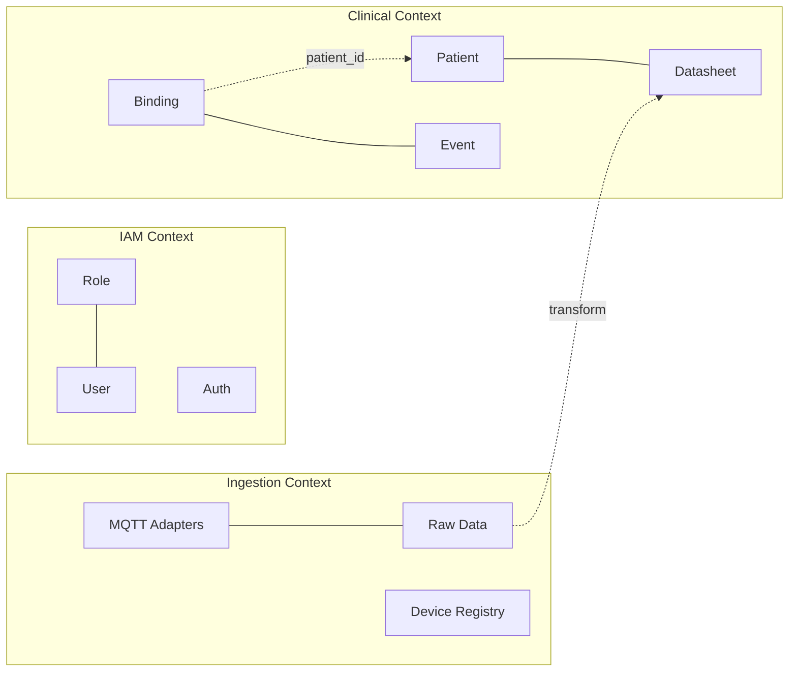
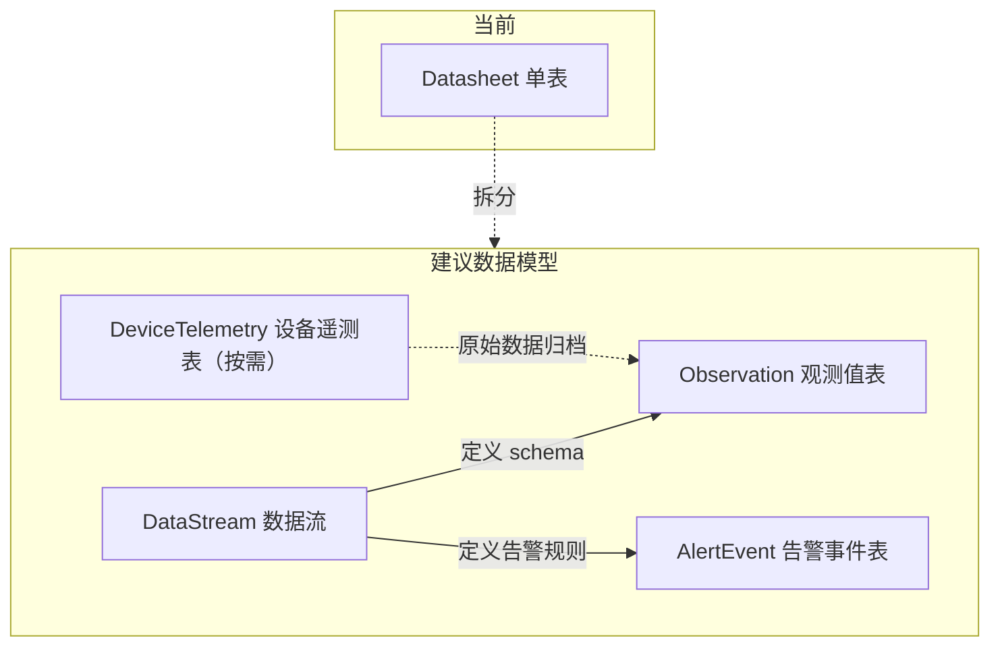

# 架构演进分析：DDD + 健康数据重构

> 基于当前代码库 [`src/lib.rs`](src/lib.rs) 的完整审查，分析两个方向：
> 1. 后端代码组织向 DDD 演进的可行性
> 2. 健康数据与设备数据结构的重新设计

---

## 一、当前架构定位

### 现有架构剖面

```
API (Rocket routes)
  │
  ▼
Service (Application Services)
  │          ┌─ core/entity   (Role, User, Patient, Device, Datasheet...)
  ├── core ──┼─ core/value_object (Module, DeviceType, DataScope...)
  │          └─ core/auth     (Claims, JWT)
  │
  ▼
Repository (SQLx data access)
  │
  ▼
PostgreSQL
```

这是一个标准的 **Layered Architecture**，已经有了 DDD 的 "种子"：

| 现有元素 | DDD 程度 | 说明 |
|---------|---------|------|
| [`core/entity/`](src/core/entity/) | ✅ 强 | 实体定义清晰，与持久化解耦方向正确 |
| [`core/value_object/`](src/core/value_object/) | ✅ 强 | Module、DeviceType、DataScope 均有领域行为 |
| [`repository/`](src/repository/) | ⚠️ 中 | 无 Repository trait 抽象，直接 impl struct |
| [`service/`](src/service/) | ⚠️ 弱 | 是 Application Service 而非 Domain Service |
| Aggregate | ❌ 无 | 未定义聚合根和边界 |
| Domain Events | ❌ 无 | 无事件驱动机制 |

---

## 二、方向一：DDD 演进可行性分析

### 可行性等级：✅ 中等可行，推荐渐进式

### 2.1 适合立即引入的 DDD 模式

#### 2.1.1 Repository Trait 抽象

**现状**：Repository 是具体 struct，没有 trait 接口。

```
// 当前
pub struct RoleRepository<'a> { pool: &'a PgPool }
impl<'a> RoleRepository<'a> { ... }

// DDD 建议
pub trait RoleRepository: Send + Sync {
    async fn find_by_id(&self, id: &Uuid) -> AppResult<Option<Role>>;
    async fn create(&self, role: &NewRole) -> AppResult<Role>;
}
```

**收益**：测试时可 mock Repository、Service 层不依赖具体 DB 实现。

**成本**：低。现有 7 个 Repository，每个增加 ~20 行 trait 定义。需要将 `&'a PgPool` 生命周期改为 Arc 或 owned。

**影响范围**：
- [`src/repository/role.rs`](src/repository/role.rs)
- [`src/repository/user.rs`](src/repository/user.rs)
- [`src/repository/device.rs`](src/repository/device.rs)
- [`src/repository/patient.rs`](src/repository/patient.rs)
- [`src/repository/binding.rs`](src/repository/binding.rs)
- [`src/repository/data.rs`](src/repository/data.rs)
- [`src/repository/audit_log.rs`](src/repository/audit_log.rs)

#### 2.1.2 聚合根定义

**当前缺失的聚合边界**：

```
当前: Patient ─── Binding ─── Device      (平铺关系，无聚合根)
                    │
                    ▼
                Datasheet                  (无主从概念)

DDD 建议:
Patient Aggregate:
  Root: Patient
  Children: PatientProfile, Binding[]
  
Device Aggregate:
  Root: Device
  Children: (无，独立实体)

Data Aggregate:
  Root: Datasheet / DataPoint
  ValueObjects: DataCategory, Severity, EventStatus
```

**收益**：
- 明确删除级联语义（删除 Patient 时，其 Binding 如何处理）
- 数据一致性边界清晰
- DataService 职责收敛

**成本**：中。需重新审视每个 Aggregate 的生命周期方法，但现有实体结构已接近此划分。

#### 2.1.3 限界上下文 Bounded Context

当前项目可以识别出 3 个自然限界上下文：



**收益**：模块间耦合度降低，IAM 变化不影响 Clinical，反之亦然。

**成本**：低。当前 `src/` 下的目录结构已经近似此划分，主要工作是收紧跨模块依赖。

### 2.2 不推荐引入的模式（过度设计）

| 模式 | 不推荐原因 |
|------|-----------|
| CQRS | 系统查询/写入负载差异不大，增加复杂度无实际收益 |
| Event Sourcing | 时序数据本身是 append-only，但业务实体（Role/User）不需要事件溯源 |
| Saga / Process Manager | 无跨聚合的长时事务场景 |
| Hexagonal Architecture | 系统只有一种输入方式（HTTP/MQTT），不需要端口适配器抽象 |

### 2.3 DDD 演进路线图

```
Phase A (低风险, ~2天)
├── 新增 Repository trait 定义（core/ 层）
├── 现有 impl 自动满足 trait
└── Service 改为依赖 trait 而非具体 struct

Phase B (中风险, ~3天)  
├── 定义 Aggregate Root 标记 trait
├── 明确 Patient Aggregate 边界
├── 明确 Data Aggregate 边界
└── 跨 Aggregate 引用使用 ID 而非对象引用

Phase C (可选, ~1天)
├── 新增 Domain Events (binding_created, data_ingested)
├── 使用简单的 event bus (tokio::sync::broadcast)
└── 解耦跨上下文通知逻辑
```

---

## 三、方向二：健康数据与设备数据重新设计

### 可行性等级：✅ 高可行，推荐优先实施

### 3.1 当前数据模型痛点

```
Datasheet 表字段:
├── id: Uuid
├── time: Timestamptz
├── device_id: Option<Uuid>        ← 可空，地位下降
├── patient_id: Option<Uuid>       ← 从绑定自动填充
├── data_type: String              ← 语义不明确（heart_rate / fall_detection 混杂）
├── data_category: String          ← metric / event（共享同一表）
├── value_numeric: Option<f64>     ← metric 专用
├── value_text: Option<String>     ← event 专用
├── severity: Option<String>       ← event 专用
├── status: Option<String>         ← event 专用
├── payload: JSONB                 ← 兜底字段
└── source: String
```

**核心问题**：`Datasheet` 表同时承载 metric 和 event 两类截然不同的数据，导致大量可选字段，查询效率降低。

### 3.2 重构方案：时序数据 + 事件数据分离

#### 3.2.1 新数据模型



#### 3.2.2 新增概念：DataStream

```rust
/// 数据流 - 逻辑上的数据源抽象
/// 一个 DataStream 代表一类持续产生的健康数据
/// 例如：Patient X 的实时心率、Patient Y 的床垫压力
pub struct DataStream {
    pub id: Uuid,
    pub patient_id: Uuid,
    pub stream_type: StreamType,  // heart_rate / bed_pressure / fall_detection
    pub device_id: Option<Uuid>,  // 当前绑定设备（可更换）
    pub unit: Option<String>,     // 单位：bpm / mmHg / ...
    pub metadata: serde_json::Value,
}

pub enum StreamType {
    HeartRate,
    BloodPressure,
    BedPressure,
    FallDetection,
    SpO2,
    // ...
}
```

**收益**：
- 设备更换不影响数据连续性（换设备只需更新 `DataStream.device_id`）
- 语义清晰：`data_type: "heart_rate"` → `stream_type: HeartRate`
- 数据可追溯：查询 "Patient X 的心率历史" 不再需要关联 Binding 表

#### 3.2.3 Observation 表（替代 Datasheet 的 metric 部分）

```sql
CREATE TABLE observations (
    id UUID PRIMARY KEY,
    stream_id UUID NOT NULL REFERENCES data_streams(id),
    time TIMESTAMPTZ NOT NULL,
    value DOUBLE PRECISION NOT NULL,
    unit VARCHAR(32),
    metadata JSONB DEFAULT '{}',
    ingested_at TIMESTAMPTZ NOT NULL DEFAULT NOW()
);

CREATE INDEX idx_observations_stream_time ON observations(stream_id, time DESC);
```

#### 3.2.4 AlertEvent 表（替代 Datasheet 的 event 部分）

```sql
CREATE TABLE alert_events (
    id UUID PRIMARY KEY,
    patient_id UUID NOT NULL,
    stream_id UUID REFERENCES data_streams(id),
    event_type VARCHAR(64) NOT NULL,        -- fall_detected / pressure_ulcer_risk / ...
    severity VARCHAR(16) NOT NULL,           -- info / warning / alert
    status VARCHAR(16) NOT NULL DEFAULT 'active',  -- active / acknowledged / resolved
    message TEXT,
    details JSONB DEFAULT '{}',
    occurred_at TIMESTAMPTZ NOT NULL,
    acknowledged_at TIMESTAMPTZ,
    acknowledged_by UUID,
    resolved_at TIMESTAMPTZ,
    resolved_by UUID,
    created_at TIMESTAMPTZ NOT NULL DEFAULT NOW()
);
```

### 3.3 迁移策略

```
Step 1 (无损扩展)
├── 新增 data_streams 表（可独立上线）
├── 新增 observations 表（新数据写入新表）
├── 新增 alert_events 表（新告警写入新表）
└── 原 datasheet 表保留（旧数据只读）

Step 2 (双写过渡)
├── Ingest 层同时写 datasheet + observations/alert_events
├── API 查询层做 UNION ALL
└── 比较性能后决定是否完全切换

Step 3 (下线旧表)
├── 数据迁移验证
├── API 完全指向新表
└── 删除 datasheet 表
```

### 3.4 设备角色重构

| 当前 | 建议 | 说明 |
|------|------|------|
| `Device` 是独立实体 | `Device` 降级为 "遥测源" | 设备只负责产生原始数据 |
| 查询依赖 `device_id` | 查询依赖 `stream_id` | 数据语义与物理设备解耦 |
| Ingest → Device → Binding → Patient → Data | Ingest → Device → Stream → Data | Stream 是语义层 |
| 设备类型用 String | 设备类型用 `DeviceType` VO | 已有值对象，整合即可 |

### 3.5 对现有系统的影响

| 模块 | 影响度 | 说明 |
|------|--------|------|
| [`src/ingest/`](src/ingest/) | 高 | ingest 模块需创建或路由到 Stream |
| [`src/service/data.rs`](src/service/data.rs) | 高 | DataService 需支持新模型 |
| [`src/repository/data.rs`](src/repository/data.rs) | 高 | DataRepository 需新增/修改查询 |
| [`src/api/routes/data.rs`](src/api/routes/data.rs) | 中 | 部分端点返回结构需调整 |
| [`src/core/entity/datasheet.rs`](src/core/entity/datasheet.rs) | 高 | 合并/拆分实体 |
| [`src/dto/`](src/dto/) | 中 | DTO 调整 |
| IAM 模块 (Role/User/Auth) | 无 | 不受影响 |

---

## 四、综合建议优先级

```
高优先级 ──── 设备→数据流 重构（方向二先行）
    │
    ├── DataStream 概念引入
    ├── Observation / AlertEvent 分表
    └── Device 角色降级
    │
中优先级 ──── Repository trait 抽象（方向一 Phase A）
    │
    ├── Repository 接口定义
    └── Service 层依赖注入
    │
低优先级 ──── 聚合根 + 限界上下文（方向一 Phase B）
    │
    ├── Aggregate 边界定义
    └── Domain Events（可选）
    │
未来 ──── OpenAPI 代码生成
    └── 前端类型自动生成（原阶段 3）
```

### 核心建议

1. **先做数据模型重构**（方向二）。健康数据是系统的核心，数据结构决定上层建筑。当前 `Datasheet` 单表已成为瓶颈，分离为 `Observations` + `AlertEvents` + `DataStreams` 能显著提升查询效率和语义清晰度。

2. **DDD 做精选而非全盘**。引入 Repository trait（简单且收益高），但避免 CQRS/Event Sourcing 等重型模式。Aggregate 边界自然演进，不必强行定义。

3. **Ingest 层插件化**是前置条件。如果数据模型变化，Ingest 模块需要能灵活适配新的 Stream 类型。建议先完成 [`docs/PHASE2_OPTIMIZATION.md`](docs/PHASE2_OPTIMIZATION.md) 中的 P2-4 Ingest 层插件化，再做数据模型重构。
