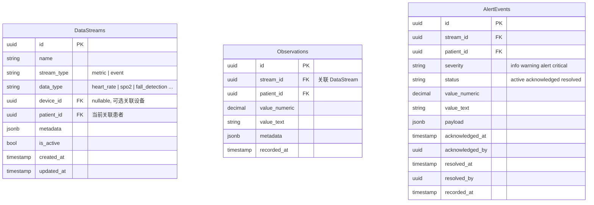
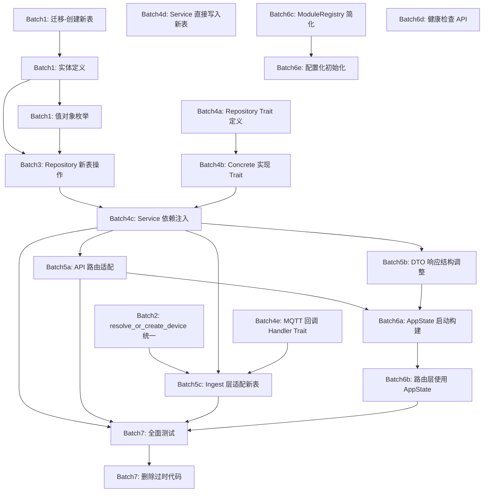

# 重构实施计划 v2

> 基于 [`ARCHITECTURE_EVOLUTION.md`](plans/ARCHITECTURE_EVOLUTION.md) 分析
>
> **反馈已采纳**: 不考虑向后兼容，执行中清除过时代码

---

## 目录

1. [方向二：数据模型重构（优先）](#方向二数据模型重构)
2. [方向一 Phase A：DDD 精选引入](#方向一-phase-addd-精选引入)
3. [方向三：Ingest 插件化优化](#方向三ingest-插件化优化)
4. [执行顺序与依赖关系](#执行顺序与依赖关系)
5. [决策日志](#决策日志)

---

## 方向二：数据模型重构

### 目标

将当前单一 [`Datasheet`](src/core/entity/datasheet.rs:105) 表拆分为三张独立表，引入 `DataStream` 概念解耦设备与数据的关系。**不保留旧表，不双写，直接切换**。

### 新数据模型



**关键变更**: `datasheet` 表在新表就绪后**直接删除**，所有数据操作迁移到新表。

### 步骤分解

#### Step 1: 数据库迁移 — 创建新表 + 删除旧表

**文件**: 
- `migrations/20260501000001_data_streams.up.sql` — 创建新表
- `migrations/20260501000001_data_streams.down.sql` — 回滚
- `migrations/20260501000002_remove_datasheet.up.sql` — 删除旧表

```sql
-- 20260501000001_data_streams.up.sql

-- 1. data_streams 表
CREATE TABLE data_streams (
    id UUID PRIMARY KEY DEFAULT gen_random_uuid(),
    name TEXT NOT NULL,
    stream_type TEXT NOT NULL CHECK (stream_type IN ('metric', 'event')),
    data_type TEXT NOT NULL,
    device_id UUID REFERENCES device(id) ON DELETE SET NULL,
    patient_id UUID REFERENCES patient(id) ON DELETE SET NULL,
    metadata JSONB DEFAULT '{}',
    is_active BOOLEAN DEFAULT true,
    created_at TIMESTAMPTZ NOT NULL DEFAULT NOW(),
    updated_at TIMESTAMPTZ NOT NULL DEFAULT NOW()
);

CREATE INDEX idx_data_streams_patient ON data_streams(patient_id);
CREATE INDEX idx_data_streams_device ON data_streams(device_id);
CREATE INDEX idx_data_streams_type ON data_streams(stream_type);

-- 2. observations 表
CREATE TABLE observations (
    id UUID PRIMARY KEY DEFAULT gen_random_uuid(),
    stream_id UUID NOT NULL REFERENCES data_streams(id) ON DELETE CASCADE,
    patient_id UUID NOT NULL REFERENCES patient(id) ON DELETE CASCADE,
    value_numeric DECIMAL(10,4),
    value_text TEXT,
    metadata JSONB DEFAULT '{}',
    recorded_at TIMESTAMPTZ NOT NULL DEFAULT NOW()
);

CREATE INDEX idx_observations_stream_time ON observations(stream_id, recorded_at DESC);
CREATE INDEX idx_observations_patient_time ON observations(patient_id, recorded_at DESC);

-- 3. alert_events 表
CREATE TABLE alert_events (
    id UUID PRIMARY KEY DEFAULT gen_random_uuid(),
    stream_id UUID NOT NULL REFERENCES data_streams(id) ON DELETE CASCADE,
    patient_id UUID NOT NULL REFERENCES patient(id) ON DELETE CASCADE,
    severity TEXT NOT NULL CHECK (severity IN ('info', 'warning', 'alert', 'critical')),
    status TEXT NOT NULL DEFAULT 'active' CHECK (status IN ('active', 'acknowledged', 'resolved')),
    value_numeric DECIMAL(10,4),
    value_text TEXT,
    payload JSONB DEFAULT '{}',
    acknowledged_at TIMESTAMPTZ,
    acknowledged_by UUID REFERENCES "user"(id),
    resolved_at TIMESTAMPTZ,
    resolved_by UUID REFERENCES "user"(id),
    recorded_at TIMESTAMPTZ NOT NULL DEFAULT NOW()
);

CREATE INDEX idx_alert_events_patient_status ON alert_events(patient_id, status, recorded_at DESC);
CREATE INDEX idx_alert_events_severity ON alert_events(severity);
```

```sql
-- 20260501000002_remove_datasheet.up.sql
DROP TABLE IF EXISTS datasheet CASCADE;
```

#### Step 2: 核心实体 — 新建 + 删除旧

**新建文件**:
- [`src/core/entity/data_stream.rs`](src/core/entity/data_stream.rs)
- [`src/core/entity/alert_event.rs`](src/core/entity/alert_event.rs)

**删除文件**:
- `src/core/entity/datasheet.rs`

**data_stream.rs**:
```rust
use chrono::{DateTime, Utc};
use serde::{Deserialize, Serialize};
use uuid::Uuid;

#[derive(Debug, Clone, Serialize, Deserialize)]
pub enum DataStreamType {
    Metric,
    Event,
}

#[derive(Debug, Clone, Serialize, Deserialize)]
pub struct DataStream {
    pub id: Uuid,
    pub name: String,
    pub stream_type: DataStreamType,
    pub data_type: String,
    pub device_id: Option<Uuid>,
    pub patient_id: Option<Uuid>,
    pub metadata: serde_json::Value,
    pub is_active: bool,
    pub created_at: DateTime<Utc>,
    pub updated_at: DateTime<Utc>,
}

#[derive(Debug, Clone)]
pub struct Observation {
    pub id: Uuid,
    pub stream_id: Uuid,
    pub patient_id: Uuid,
    pub value_numeric: Option<rust_decimal::Decimal>,
    pub value_text: Option<String>,
    pub metadata: serde_json::Value,
    pub recorded_at: DateTime<Utc>,
}
```

**alert_event.rs**:
```rust
use chrono::{DateTime, Utc};
use serde::{Deserialize, Serialize};
use uuid::Uuid;

#[derive(Debug, Clone, Serialize, Deserialize)]
pub enum AlertSeverity {
    Info,
    Warning,
    Alert,
    Critical,
}

#[derive(Debug, Clone, Serialize, Deserialize)]
pub enum AlertStatus {
    Active,
    Acknowledged,
    Resolved,
}

#[derive(Debug, Clone)]
pub struct AlertEvent {
    pub id: Uuid,
    pub stream_id: Uuid,
    pub patient_id: Uuid,
    pub severity: AlertSeverity,
    pub status: AlertStatus,
    pub value_numeric: Option<rust_decimal::Decimal>,
    pub value_text: Option<String>,
    pub payload: serde_json::Value,
    pub acknowledged_at: Option<DateTime<Utc>>,
    pub acknowledged_by: Option<Uuid>,
    pub resolved_at: Option<DateTime<Utc>>,
    pub resolved_by: Option<Uuid>,
    pub recorded_at: DateTime<Utc>,
}
```

**更新** [`src/core/entity/mod.rs`](src/core/entity/mod.rs):
- 删除 `mod datasheet; pub use datasheet::*;`
- 添加 `mod data_stream; pub use data_stream::*;`
- 添加 `mod alert_event; pub use alert_event::*;`

#### Step 3: 值对象 — 新增枚举

**文件**: [`src/core/value_object/mod.rs`](src/core/value_object/mod.rs)

将 `DataStreamType`、`AlertSeverity`、`AlertStatus` 的 `Display`/`FromStr` 实现放在值对象层，实体层保持纯数据。

新建 `src/core/value_object/alert_severity.rs` 等文件，或直接放在实体中。**建议**: 枚举定义在实体，`Display`/`FromStr` 也放在实体文件（单一职责，避免跨文件引用）。

#### Step 4: Repository 层 — 新建替代，删除旧

**新建文件**:
- [`src/repository/data_stream.rs`](src/repository/data_stream.rs)
- [`src/repository/observation.rs`](src/repository/observation.rs)  
- [`src/repository/alert_event.rs`](src/repository/alert_event.rs)

**删除文件**:
- `src/repository/data.rs`

**DataStreamRepository** (`data_stream.rs`):
```rust
use sqlx::PgPool;
// ...

pub struct DataStreamRepository {
    pool: PgPool,
}

impl DataStreamRepository {
    pub fn new(pool: PgPool) -> Self { Self { pool } }

    pub async fn create(&self, name: &str, stream_type: &DataStreamType,
        data_type: &str, device_id: Option<Uuid>, patient_id: Option<Uuid>
    ) -> AppResult<DataStream>;

    pub async fn find_or_create(&self, device_id: &Uuid, data_type: &str,
        stream_type: &DataStreamType
    ) -> AppResult<DataStream>;

    pub async fn find_by_patient(&self, patient_id: &Uuid) -> AppResult<Vec<DataStream>>;
}
```

**ObservationRepository** (`observation.rs`):
```rust
pub struct ObservationRepository { pool: PgPool }
impl ObservationRepository {
    pub fn new(pool: PgPool) -> Self { Self { pool } }

    pub async fn insert(&self, obs: &NewObservation) -> AppResult<Observation>;
    pub async fn query(&self, patient_id: &Uuid, limit: i64, offset: i64) -> AppResult<Vec<Observation>>;
    pub async fn count(&self, patient_id: &Uuid) -> AppResult<i64>;
    pub async fn find_latest(&self, patient_id: &Uuid) -> AppResult<Option<Observation>>;
}
```

**AlertEventRepository** (`alert_event.rs`):
```rust
pub struct AlertEventRepository { pool: PgPool }
impl AlertEventRepository {
    pub fn new(pool: PgPool) -> Self { Self { pool } }

    pub async fn insert(&self, alert: &NewAlertEvent) -> AppResult<AlertEvent>;
    pub async fn query_active(&self, patient_id: &Uuid) -> AppResult<Vec<AlertEvent>>;
    pub async fn acknowledge(&self, id: &Uuid, by: &Uuid) -> AppResult<AlertEvent>;
    pub async fn resolve(&self, id: &Uuid, by: &Uuid) -> AppResult<AlertEvent>;
    pub async fn get_stats(&self, patient_id: &Uuid) -> AppResult<AlertStats>;
}
```

**更新** [`src/repository/mod.rs`](src/repository/mod.rs):
- 删除 `mod data; pub use data::*;`
- 添加 `mod data_stream; pub use data_stream::*;`
- 添加 `mod observation; pub use observation::*;`
- 添加 `mod alert_event; pub use alert_event::*;`

#### Step 5: Service 层 — 完全重写 `DataService`

**文件**: [`src/service/data.rs`](src/service/data.rs) — 完全重写，删除旧引用

```rust
use crate::core::entity::*;
use crate::repository::*;

pub struct DataService {
    stream_repo: DataStreamRepository,
    obs_repo: ObservationRepository,
    alert_repo: AlertEventRepository,
}

impl DataService {
    pub fn new(
        stream_repo: DataStreamRepository,
        obs_repo: ObservationRepository,
        alert_repo: AlertEventRepository,
    ) -> Self { Self { stream_repo, obs_repo, alert_repo } }

    pub async fn ingest_metric(
        &self, device_id: &Uuid, patient_id: &Uuid,
        data_type: &str, value_numeric: f64, metadata: serde_json::Value,
    ) -> AppResult<()> {
        let stream = self.stream_repo
            .find_or_create(device_id, data_type, &DataStreamType::Metric)
            .await?;
        self.obs_repo.insert(&NewObservation {
            stream_id: stream.id,
            patient_id: *patient_id,
            value_numeric: Some(rust_decimal::Decimal::try_from(value_numeric).unwrap()),
            value_text: None,
            metadata,
            recorded_at: Utc::now(),
        }).await?;
        Ok(())
    }

    pub async fn ingest_event(
        &self, device_id: &Uuid, patient_id: &Uuid,
        data_type: &str, severity: AlertSeverity,
        value_numeric: Option<f64>, value_text: Option<String>,
        payload: serde_json::Value,
    ) -> AppResult<()> {
        let stream = self.stream_repo
            .find_or_create(device_id, data_type, &DataStreamType::Event)
            .await?;
        self.alert_repo.insert(&NewAlertEvent {
            stream_id: stream.id,
            patient_id: *patient_id,
            severity,
            status: AlertStatus::Active,
            value_numeric: value_numeric.map(|v| rust_decimal::Decimal::try_from(v).unwrap()),
            value_text,
            payload,
            recorded_at: Utc::now(),
        }).await?;
        Ok(())
    }

    pub async fn query(&self, patient_id: &Uuid, limit: i64, offset: i64) -> AppResult<Vec<Observation>>;
    pub async fn query_alerts(&self, patient_id: &Uuid) -> AppResult<Vec<AlertEvent>>;
    pub async fn acknowledge_alert(&self, id: &Uuid, by: &Uuid) -> AppResult<AlertEvent>;
    pub async fn resolve_alert(&self, id: &Uuid, by: &Uuid) -> AppResult<AlertEvent>;
    pub async fn get_latest(&self, patient_id: &Uuid) -> AppResult<Option<Observation>>;
    pub async fn get_alert_stats(&self, patient_id: &Uuid) -> AppResult<AlertStats>;
}
```

#### Step 6: DTO 层 — 响应结构调整

**文件**: [`src/dto/response/data.rs`](src/dto/response/data.rs)

- 删除: 旧的 `DataReportResponse`, `DataQueryResponse`, `AlertStatsResponse` 中引用旧实体的字段
- 新增: `ObservationResponse`, `AlertEventResponse`
- 保留: `RawDataRecordResponse`, `RawDataDetailResponse`, `RawDataQueryResponse` (这些与 ingest_raw 相关，不涉及 datasheet)

```rust
#[derive(Serialize)]
pub struct ObservationResponse {
    pub id: Uuid,
    pub stream_id: Uuid,
    pub patient_id: Uuid,
    pub data_type: String,
    pub value_numeric: Option<Decimal>,
    pub value_text: Option<String>,
    pub recorded_at: DateTime<Utc>,
}

#[derive(Serialize)]
pub struct AlertEventResponse {
    pub id: Uuid,
    pub stream_id: Uuid,
    pub patient_id: Uuid,
    pub data_type: String,
    pub severity: String,
    pub status: String,
    pub value_numeric: Option<Decimal>,
    pub value_text: Option<String>,
    pub payload: serde_json::Value,
    pub recorded_at: DateTime<Utc>,
}

#[derive(Serialize)]
pub struct DataQueryResponse {
    pub data: Vec<ObservationResponse>,
    pub total: i64,
    pub page: u32,
    pub page_size: u32,
}
```

#### Step 7: API 路由层 — 适配新 Service

**文件**: [`src/api/routes/data.rs`](src/api/routes/data.rs)

- `report_data()`: 调用 `service.ingest_metric()` 或 `service.ingest_event()`
- `query_data()`: 调用 `service.query()`，返回 `DataQueryResponse` (新结构)
- `query_alerts()`: 调用 `service.query_alerts()`，返回 `Vec<AlertEventResponse>`
- `acknowledge_event()`: 调用 `service.acknowledge_alert()`
- `resolve_event()`: 调用 `service.resolve_alert()`

**注意**: 删除对旧类型如 `DataReportRequest`、`DataPoint` 的引用。

#### Step 8: Ingest 层适配 — 直接写入新表

**文件**: 
- [`src/ingest/modules/mattress.rs`](src/ingest/modules/mattress.rs)
- [`src/ingest/modules/vision.rs`](src/ingest/modules/vision.rs)
- [`src/ingest/modules/imu.rs`](src/ingest/modules/imu.rs)

**改造点**:
1. 所有模块中 `use crate::repository::DataRepository` → 替换为新 Repository
2. 模块持有 `DataStreamRepository` + `ObservationRepository` + `AlertEventRepository` 而非 `DataRepository`
3. 调用新方法写入 observations/alert_events

**mattress.rs 示例改造**:
```rust
// 旧: data_repo.insert_datapoint(&data_point).await?;
// 新:
let stream = stream_repo.find_or_create(&device_id, "mattress_pressure", &DataStreamType::Metric).await?;
obs_repo.insert(&NewObservation {
    stream_id: stream.id,
    patient_id,
    value_numeric: Some(pressure_value),
    value_text: None,
    metadata: json!({}),
    recorded_at: Utc::now(),
}).await?;
```

#### Step 9: 全面测试

| 测试范围 | 文件 | 内容 |
|----------|------|------|
| 单元测试 — 实体 | `data_stream.rs`, `alert_event.rs` | 构造 + Display/FromStr |
| 单元测试 — 枚举 | 同上 | `DataStreamType`, `AlertSeverity`, `AlertStatus` |
| 集成测试 — Repository | 新建 `data_stream_test.rs` 等 | 新表 CRUD |
| 集成测试 — Service | `data_test.rs` | ingest/query/alert 全流程 |
| API 测试 | 在路由层验证 | 请求/响应格式正确 |

---

## 方向一 Phase A：DDD 精选引入

### 目标

最低成本引入最关键的 DDD 模式：**Repository Trait 抽象** + **聚合根边界梳理**。不引入 CQRS / Event Sourcing / Hexagonal 等重模式。

### 当前问题

```rust
// 当前: 生命周期耦合 + 具体实现耦合
pub struct DataRepository<'a> { pool: &'a PgPool }
pub struct DataService<'a> { pool: &'a PgPool }
```

导致 Service 层无法脱离 `PgPool` 单元测试。

### 步骤分解

#### Step A1: 定义 Repository Trait

**文件**: 新建 [`src/repository/traits.rs`](src/repository/traits.rs)

```rust
#[async_trait]
pub trait DataStreamRepository: Send + Sync {
    async fn find_or_create(&self, device_id: &Uuid, data_type: &str, stream_type: &DataStreamType) -> AppResult<DataStream>;
    async fn find_by_patient(&self, patient_id: &Uuid) -> AppResult<Vec<DataStream>>;
}

#[async_trait]
pub trait ObservationRepository: Send + Sync {
    async fn insert(&self, obs: &NewObservation) -> AppResult<Observation>;
    async fn query(&self, patient_id: &Uuid, limit: i64, offset: i64) -> AppResult<Vec<Observation>>;
    async fn count(&self, patient_id: &Uuid) -> AppResult<i64>;
    async fn find_latest(&self, patient_id: &Uuid) -> AppResult<Option<Observation>>;
}

#[async_trait]
pub trait AlertEventRepository: Send + Sync {
    async fn insert(&self, alert: &NewAlertEvent) -> AppResult<AlertEvent>;
    async fn query_active(&self, patient_id: &Uuid) -> AppResult<Vec<AlertEvent>>;
    async fn acknowledge(&self, id: &Uuid, by: &Uuid) -> AppResult<AlertEvent>;
    async fn resolve(&self, id: &Uuid, by: &Uuid) -> AppResult<AlertEvent>;
    async fn get_stats(&self, patient_id: &Uuid) -> AppResult<AlertStats>;
}

// 优先抽象的 Repository:
#[async_trait]
pub trait RoleRepository: Send + Sync {
    async fn find_by_id(&self, id: &Uuid) -> AppResult<Option<Role>>;
    async fn list_all(&self) -> AppResult<Vec<Role>>;
    async fn create(&self, new_role: &NewRole) -> AppResult<Role>;
    async fn update(&self, id: &Uuid, update: &UpdateRole) -> AppResult<Role>;
    async fn delete(&self, id: &Uuid) -> AppResult<()>;
    async fn get_data_scope(&self, role_id: &Uuid) -> AppResult<String>;
}

#[async_trait]
pub trait UserRepository: Send + Sync {
    async fn find_by_id(&self, id: &Uuid) -> AppResult<Option<User>>;
    async fn find_by_username(&self, username: &str) -> AppResult<Option<User>>;
    async fn create(&self, new_user: &NewUser) -> AppResult<User>;
    // ...
}
```

#### Step A2: Concrete Repository 实现 Trait + 去除生命周期

```rust
// PgDataStreamRepository 实现 DataStreamRepository trait
pub struct PgDataStreamRepository {
    pool: PgPool,  // owned, 不再 &'a PgPool
}

#[async_trait]
impl DataStreamRepository for PgDataStreamRepository {
    async fn find_or_create(&self, device_id: &Uuid, data_type: &str, stream_type: &DataStreamType) -> AppResult<DataStream> {
        // 具体 SQL 逻辑
    }
}
```

**关键改动**: `&'a PgPool` → `PgPool`，`PgPool` 内部是 `Arc<InnerPool>`，clone 零成本。

**优先改造的 Repository**:
| Repository | 优先级 | 理由 |
|------------|--------|------|
| `DataStreamRepository` | 最高 | 新建，直接应用 Trait |
| `ObservationRepository` | 最高 | 新建，直接应用 Trait |
| `AlertEventRepository` | 最高 | 新建，直接应用 Trait |
| `RoleRepository` | 高 | 权限逻辑需要独立测试 |
| `UserRepository` | 高 | 用户管理核心 |
| `PatientRepository` | 中 | CRUD 偏重，mock 价值中等 |
| `BindingRepository` | 低 | 可后续处理 |
| `DeviceRepository` | 低 | 可后续处理 |

#### Step A3: Service 层依赖注入

```rust
// 改造后: 依赖 Trait 而非 Concrete
pub struct DataService {
    stream_repo: Box<dyn DataStreamRepository>,
    obs_repo: Box<dyn ObservationRepository>,
    alert_repo: Box<dyn AlertEventRepository>,
}

impl DataService {
    pub fn new(
        stream_repo: Box<dyn DataStreamRepository>,
        obs_repo: Box<dyn ObservationRepository>,
        alert_repo: Box<dyn AlertEventRepository>,
    ) -> Self {
        Self { stream_repo, obs_repo, alert_repo }
    }
}
```

**注意**: 方向二 Step 5 中的 Service 直接使用了 Concrete Repository。方向一 A3 Step 将其升级为 Trait 依赖。如果计划是分批次执行，批次 4 中直接使用 Trait 版本，避免一次重写。

#### Step A4: 路由层 — 启动时构建 AppState

**文件**: [`src/main.rs`](src/main.rs) 中 `build_rocket()` 函数

```rust
pub struct AppState {
    pub data_service: DataService,
    pub admin_service: AdminService,
    pub auth_service: AuthService,
    pub user_service: UserService,
    pub patient_service: PatientService,
    pub device_service: DeviceService,
    pub binding_service: BindingService,
}

async fn build_rocket() -> Rocket<Build> {
    let pool = ...;
    let app_state = AppState {
        data_service: DataService::new(
            Box::new(PgDataStreamRepository::new(pool.clone())),
            Box::new(PgObservationRepository::new(pool.clone())),
            Box::new(PgAlertEventRepository::new(pool.clone())),
        ),
        admin_service: AdminService::new(
            Box::new(PgRoleRepository::new(pool.clone())),
        ),
        // ...
    };
    
    rocket::build()
        .manage(app_state)
        .mount("/api", routes![...])
        // ...
}
```

**路由层使用**:
```rust
#[get("/data?<query..>")]
pub async fn query_data(
    state: &rocket::State<AppState>,
    query: DataQuery,
) -> Result<Json<DataQueryResponse>, AppError> {
    let result = state.data_service.query(...).await?;
    Ok(Json(result))
}
```

#### Step A5: 聚合根边界梳理

| 聚合根 | 包含实体 | 说明 |
|--------|----------|------|
| **User** | User, RefreshToken | 身份认证聚合，role_id 引用而非嵌套 |
| **Role** | Role, Module | 权限聚合 |
| **Patient** | Patient, PatientProfile, Binding | 患者聚合，Binding 管理设备关联 |
| **Device** | Device | 设备聚合，简化后仅保留核心属性 |
| **DataStream** | DataStream, Observation, AlertEvent | **新聚合根**——数据领域核心 |

**不引入**:
- User 不直接聚合 Role (通过 role_id 引用)
- Patient 不直接聚合 Binding (通过 binding table 关联)
- 不引入 Repository Factory 或 Unit of Work

#### Step A6: Mock 测试基础设施

```rust
// tests/common/mock_repos.rs
pub struct MockStreamRepo {
    pub streams: Vec<DataStream>,
}

#[async_trait]
impl DataStreamRepository for MockStreamRepo {
    async fn find_or_create(&self, device_id: &Uuid, data_type: &str, stream_type: &DataStreamType) -> AppResult<DataStream> {
        Ok(self.streams.first().cloned().unwrap_or(DataStream::default()))
    }
}

// 测试示例
#[tokio::test]
async fn test_data_service_ingest_metric() {
    let service = DataService::new(
        Box::new(MockStreamRepo { streams: vec![mock_stream()] }),
        Box::new(MockObsRepo { observations: vec![] }),
        Box::new(MockAlertRepo { alerts: vec![] }),
    );
    let result = service.ingest_metric(...).await;
    assert!(result.is_ok());
}
```

---

## 方向三：Ingest 插件化优化

### 目标

保留现有插件化架构，消除模块间重复代码，提高可配置性和可观测性。

### 当前问题

| 问题 | 涉及文件 | 说明 |
|------|----------|------|
| 1. `resolve_or_create_device` 重复 | [`mod.rs`](src/ingest/modules/mod.rs:76) + [`imu.rs`](src/ingest/modules/imu.rs:417) | 两个位置定义了相同函数 |
| 2. MQTT 模块的 `run` 结构相似 | [`vision.rs`](src/ingest/modules/vision.rs), [`imu.rs`](src/ingest/modules/imu.rs) | 几乎相同的 MQTT 事件循环 + 重连逻辑 |
| 3. 模块配置散落 | 各 module 文件 + [`main.rs`](src/main.rs) | 初始化分散，不易管理 |
| 4. 缺少运行状态可见性 | 无 | 无法知道模块是否在正常运行 |

### 步骤分解

#### Step I1: 统一 `resolve_or_create_device`

**文件**: [`src/ingest/modules/mod.rs`](src/ingest/modules/mod.rs)

```rust
/// 统一的设备解析/自动注册函数
pub async fn resolve_or_create_device(
    pool: &PgPool,
    device_id_str: &str,
    device_type: Option<&str>,  // 可选：自动注册时指定设备类型
    auto_register: bool,
) -> AppResult<Uuid> {
    // 1. 按 serial_number 查找
    let repo = PgDeviceRepository::new(pool.clone());
    if let Some(device) = repo.find_by_serial(device_id_str).await? {
        return Ok(device.id);
    }
    
    // 2. 自动注册（如启用）
    if auto_register {
        let device = repo.create(&NewDevice {
            serial_number: device_id_str.to_string(),
            device_type: device_type.unwrap_or("unknown").to_string(),
        }).await?;
        return Ok(device.id);
    }
    
    // 3. 未找到且不自动注册
    Err(AppError::NotFound(format!("Device {} not found", device_id_str)))
}
```

**清理**: 删除 [`imu.rs`](src/ingest/modules/imu.rs) 中的重复 `resolve_or_create_device` 函数。

#### Step I2: 提炼共享 MQTT 回调处理

**文件**: [`src/ingest/modules/mqtt_runner.rs`](src/ingest/modules/mqtt_runner.rs)

当前已存在 `connect_and_subscribe`、`spawn_mqtt_task`、`run_event_loop`。新增通用 `Handler` trait 替代闭包：

```rust
#[async_trait]
pub trait MqttMessageHandler: Send + Sync {
    fn module_name(&self) -> &str;
    async fn handle(&self, publish: rumqttc::Publish, pool: &PgPool) -> AppResult<()>;
}

/// 使用 Handler trait 的通用运行器
pub async fn run_with_handler(
    params: MqttParams,
    pool: PgPool,
    handler: Box<dyn MqttMessageHandler>,
) -> AppResult<()> {
    spawn_mqtt_task(handler.module_name().to_string(), params, move |p| {
        let pool = pool.clone();
        let handler = Box::clone(&handler);  // 需要 Arc
        async move {
            let (_, mut eventloop) = connect_and_subscribe(&p).await?;
            run_event_loop(&mut eventloop, handler.module_name(), |publish| {
                tokio::spawn({
                    let pool = pool.clone();
                    let handler = handler.clone();
                    async move {
                        handler.handle(publish, &pool).await.ok();
                    }
                });
            }).await
        }
    });
}
```

**Vision 模块简化**:
```rust
pub struct VisionHandler {
    config: VisionConfig,
}

#[async_trait]
impl MqttMessageHandler for VisionHandler {
    fn module_name(&self) -> &str { "视觉识别" }
    
    async fn handle(&self, publish: rumqttc::Publish, pool: &PgPool) -> AppResult<()> {
        let payload = publish.payload;
        let topic = publish.topic;
        // ... 解析 JSON, 写入 observations/alert_events
        Ok(())
    }
}
```

#### Step I3: 简化 ModuleRegistry

**文件**: [`src/ingest/modules/mod.rs`](src/ingest/modules/mod.rs)

当前模式:
```rust
impl IngestModule for mattress::MattressModule {
    fn name(&self) -> &'static str { "smart_mattress" }
    fn description(&self) -> &'static str { "智能床垫 (TCP/Msgpack)" }
}
// vision, imu 同样的 BlanketImpl
```

**优化**: 对外隐藏 struct 字段，只暴露简单注册宏：

```rust
#[macro_export]
macro_rules! register_ingest_module {
    ($registry:expr, $module:expr) => {{
        let name = $module.name();
        log::info!("注册 Ingest 模块: {}", name);
        $registry.register(Box::new($module));
    }};
}
```

同时为 `IngestModule` 添加 `default_config()` 关联函数，使模块可以自行声明默认配置。

#### Step I4: 添加健康检查 API

**文件**: 新建 [`src/ingest/modules/health.rs`](src/ingest/modules/health.rs)

```rust
#[derive(Serialize)]
pub struct ModuleHealth {
    pub name: String,
    pub description: String,
    pub is_running: bool,
    pub uptime_seconds: Option<i64>,
    pub last_error: Option<String>,
}
```

**IngestModule trait 扩展**:
```rust
pub trait IngestModule: Send + Sync {
    fn name(&self) -> &'static str;
    fn description(&self) -> &'static str;
    fn health(&self) -> ModuleHealth;
    async fn start(&self, pool: &PgPool) -> AppResult<()>;
}
```

**API 路由**: [`src/api/routes/health.rs`](src/api/routes/health.rs) 新增端点:
```rust
#[get("/ingest/modules")]
pub async fn ingest_module_health(
    registry: &rocket::State<ModuleRegistry>,
) -> Json<Vec<ModuleHealth>> {
    Json(registry.health_check())
}
```

#### Step I5: 重构初始化流程 — 配置化模块加载

**文件**: [`src/main.rs`](src/main.rs) — `init_ingest_modules` 函数

```rust
async fn init_ingest_modules(pool: &PgPool, settings: &Settings) -> AppResult<()> {
    let mut registry = ModuleRegistry::new();
    
    if settings.ingest.mattress.enabled {
        register_ingest_module!(registry, mattress::MattressModule::new(
            settings.ingest.mattress.clone()
        ));
    }
    
    if settings.ingest.vision.enabled {
        register_ingest_module!(registry, vision::VisionModule::new(
            settings.ingest.vision.clone()
        ));
    }
    
    if settings.ingest.imu.enabled {
        register_ingest_module!(registry, imu::ImuModule::new(
            settings.ingest.imu.clone()
        ));
    }
    
    registry.start_all(pool).await
}
```

**配置扩展** [`config/default.yaml`](config/default.yaml):
```yaml
ingest:
  mattress:
    enabled: true
    bind_addr: "0.0.0.0:9001"
  vision:
    enabled: true
    mqtt_broker: "localhost"
    mqtt_port: 1883
    mqtt_topic: "device/vision/+/detect"
  imu:
    enabled: true
    mqtt_broker: "localhost"
    mqtt_port: 1883
    mqtt_topic: "device/imu/+/data"
```

---

## 执行顺序与依赖关系



### 推荐执行批次

| 批次 | 内容 | 涉及文件 | 说明 |
|------|------|----------|------|
| **Batch 1** | 方向二 Step 1-3 (迁移+实体+值对象) | 迁移 x2, 实体 x2, mod.rs | 纯新增，安全 |
| **Batch 2** | 方向三 Step I1 (统一 device 解析) | mod.rs, imu.rs | 小改动 |
| **Batch 3** | 方向二 Step 4 (Repository 新表) | repo x3 + mod.rs | 纯新增 Repository |
| **Batch 4** | **核心改造**: 方向二 Step 5 + 方向一 A1-A3 + 方向三 I2 | Service, Repository Trait, mqtt_runner | 同时完成 Service 重写 + Trait 抽象 |
| **Batch 5** | 方向二 Step 6-8 (DTO + API + Ingest 适配) | dto, routes, ingest modules | 连接所有层 |
| **Batch 6** | 方向一 A4-A6 + 方向三 I3-I5 | main.rs, ModuleRegistry, health | 基础设施完善 |
| **Batch 7** | 全面测试 + 清理过时代码 | 测试文件 + 删除旧文件 | 最终验证与清理 |

---

## 决策日志

| ID | 决策 | 选项 | 结论 |
|----|------|------|------|
| D-001 | 新实体放 `datasheet.rs` vs 拆分文件 | a) 同一文件 b) 拆分 | **拆分** — `data_stream.rs` + `alert_event.rs` |
| D-002 | 旧 `datasheet.rs` 何时删除 | a) 新表就绪后 b) 发布周期后 | **就绪后立即删除** — 不向后兼容 |
| D-003 | Repository `&'a PgPool` vs `PgPool` owned | a) 保留引用 b) 改为 owned | **Owned** — PgPool 内部是 Arc，clone 低成本 |
| D-004 | Service 依赖: 构造时注入 vs 方法参数 | a) 构造时 b) 每个方法 | **构造时注入** — 通过 AppState |
| D-005 | Service 用 Trait vs Concrete Repo | a) 先 Concrete b) 直接用 Trait | **直接用 Trait** — Batch4 一步到位 |
| D-006 | MQTT 回调: 闭包 vs Handler Trait | a) 闭包 b) Trait | **Handler Trait** — 类型安全，易组合 |
| D-007 | 所有 Repository 一次性 Trait 化 vs 分批 | a) 全做 b) 先核心 | **先核心** — DataStream, Observation, AlertEvent, Role, User |
