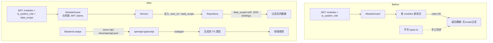

# 模块/权限系统重构 + data_scope 资源隔离 + OpenAPI 代码生成

## 背景

当前模块权限系统存在以下问题：

1. **Module 枚举和 `modules` DB 表双重定义** — 新增一个模块需要改 5 处代码
2. **`parse_module_from_path` 脆弱 URL 推导** — 通过 URL 路径猜测模块，容易出错
3. **`SystemRoleGuard` 和 `ModuleGuard` 职责重叠** — 两者都检查 `is_system_role`
4. **缺少数据级权限控制** — 只能控制"能否访问页面"，不能控制"能看到哪些数据"
5. **前端类型手动维护** — `types.ts` 538 行手写，容易和后端 DTO 脱节

## 架构变更总览

```
┌─────────────────────────────────────────────────────────────────┐
│                        BEFORE (现状)                            │
│                                                                 │
│  Module enum  ←──→  modules DB table  ←──→  ModulePermissionRepo│
│  (value_object)       (seed data)            (8 methods)         │
│                          ↑                                       │
│                    role_modules  ←──  Role (is_system_role)      │
│                                                                 │
│  资源查询: 无 scope 过滤 ← 全部返回                              │
│  前端类型: 手写 types.ts  ← 易脱节                              │
└─────────────────────────────────────────────────────────────────┘

                          ↓ 重构后

┌─────────────────────────────────────────────────────────────────┐
│                        AFTER (目标)                              │
│                                                                 │
│  Module enum (唯一来源)  ──→ 直接用于 guard 验证                  │
│      │                                                          │
│      └── role_modules (仅存 module_code TEXT, 无 FK)              │
│            ↑                                                     │
│  Role (is_system_role + data_scope)                              │
│       │                                                          │
│       ├── 'all'       → 无过滤                                   │
│       ├── 'self'      → 只返回用户绑定的患者/设备数据            │
│       └── 'department' → 返回同科室数据 (预留)                   │
│                                                                 │
│  OpenAPI (utoipa) ──→ openapi-typescript ──→ 生成 TS 类型       │
└─────────────────────────────────────────────────────────────────┘
```

## 数据流变更



---

## 阶段 1: Module 去 DB 化

### 目标
消除 `Module` 枚举和 `modules` DB 表的重复定义，让 `Module` 枚举成为唯一来源。

### 变更清单

#### 1.1 数据库迁移: `20260427000001_module_db_dedup`
**文件**: `migrations/20260427000001_module_db_dedup.up.sql`
- DROP TABLE `modules` CASCADE
- 修改 `role_modules` 表:
  - 删除 `module_id` 列 (UUID, FK → modules.id)
  - 删除 `id` 列 (serial PK, 不需要)
  - 添加 `module_code VARCHAR(64) NOT NULL`
  - 主键改为 `(role_id, module_code)`
- 迁移现有数据: INSERT INTO new_role_modules SELECT role_id, m.code FROM old_role_modules rm JOIN modules m ON rm.module_id = m.id
- 更新视图: `role_module_permissions` 改为基于 `module_code`
- 删除 `module_id_seq` 序列

**文件**: `migrations/20260427000001_module_db_dedup.down.sql`
- CREATE TABLE modules (...), INSERT seed data
- 恢复 role_modules 结构

#### 1.2 核心实体变更

**`src/core/entity/module.rs`** — 简化/移除
- 移除 `Module` 实体 struct (原来映射 DB `modules` 表)
- 移除 `RoleModule` 实体 struct (原来映射 `role_modules` 表)
- `Module` 不再暴露在 `src/core/entity/mod.rs` pub use 中
- 所有代码改用 `crate::core::value_object::Module`

**`src/core/entity/role.rs`** — 添加 data_scope 字段
- 在 `Role`, `NewRole`, `UpdateRole` 中添加:
  ```rust
  pub data_scope: Option<String>,  // 'all' | 'self' | 'department'
  ```
  注意: 此变更属于 Phase 2，此处仅做结构准备

#### 1.3 `ModulePermissionRepository` 移除

**文件**: `src/repository/module_permission.rs` — 删除整个文件
**文件**: `src/repository/mod.rs` — 移除 `mod module_permission;` 和 `pub use module_permission::*;`

替代方案: 在 `RoleRepository` 中添加 3 个方法:
```rust
pub async fn get_role_module_codes(&self, role_id: &Uuid) -> AppResult<Vec<String>>
pub async fn assign_module_code(&self, role_id: &Uuid, module_code: &str) -> AppResult<()>
pub async fn set_role_module_codes(&self, role_id: &Uuid, module_codes: &[String]) -> AppResult<()>
```

#### 1.4 `AuthService` 简化

**文件**: `src/service/auth.rs` (login + refresh_token)
- 移除 `ModulePermissionRepository` 依赖
- login/refresh 时直接查询 `role_modules` 表获取 module_codes
- 或者更进一步: role_modules 数据可以从 RoleRepository 获取

#### 1.5 `AdminService` 简化

**文件**: `src/service/admin.rs`
- `list_modules()`: 不再查 DB，直接 `Module::all().into_iter().map(...)`
- `get_role_modules()`: 直接查 role_modules 表
- `assign_module()` / `batch_assign_modules()`: 
  - 参数从 `&Uuid` (module_id) 改为 `&str` (module_code)
  - 验证改为 `Module::from_str(module_code).ok_or(AppError::ValidationError(...))`
  - 数据库操作改为写 `module_code` 到 role_modules 表
- `set_role_modules()`: 同上
- 移除 `module_exists()` DB 调用

#### 1.6 API 路由和 DTO 变更

**文件**: `src/api/routes/admin.rs`
- `list_modules`: 保持路由不变，返回数据改为 Rust enum 生成
- `assign_module`: 请求体从 `{ module_id: Uuid }` → `{ module_code: String }`
- `revoke_module`: URL 参数从 `/admin/roles/<id>/modules/<module_id:Uuid>` → `/admin/roles/<id>/modules/<module_code:String>`
- `batch_assign_modules`: 请求体从 `{ module_ids: Vec<Uuid> }` → `{ module_codes: Vec<String> }`
- `set_role_modules`: 同上
- 所有路由的 `_guard: SystemRoleGuard` 改为 `user: AuthenticatedUser` + 内部检查 `is_system_role`

**文件**: `src/dto/response/admin.rs`
- `AssignModuleRequest.module_id: Uuid` → `module_code: String`
- `BatchAssignModulesRequest.module_ids: Vec<Uuid>` → `module_codes: Vec<String>`
- `SetRoleModulesRequest.module_ids: Vec<Uuid>` → `module_codes: Vec<String>`
- `RoleModuleResponse.modules` 改为返回 `Vec<Module>` value objects
- `ModuleListResponse.modules` 同上

#### 1.7 守卫简化

**文件**: `src/api/guards/auth.rs`

**移除 `SystemRoleGuard`** — 逻辑合并到 `ModuleGuard`:
```rust
// SystemRoleGuard 删除，替换为:
impl AuthenticatedUser {
    pub fn is_system_role(&self) -> bool {
        self.is_system_role
    }
}
```
所有使用 `_guard: SystemRoleGuard` 的路由改为:
```rust
user: AuthenticatedUser,  // 在路由函数体内检查 user.is_system_role()
```

**移除 `parse_module_from_path`** — 此函数通过 URL 路径猜测模块名，太脆弱。
替代方案: 路由函数在需要模块检查时，显式传入模块代码:
```rust
// 之前: ModuleGuard 自动从 URL 解析
// 之后: 在路由或 ExplicitModuleGuard 中显式指定
```

**简化 `ModuleGuard`** — 直接从 JWT claims 验证，不查 DB:
```rust
// 之前: ModuleGuard::can_access 查询 is_system_role 设置
// 之后: can_access 直接检查 claims.can_access_module(module_code)
//      is_system_role 已由 AuthenticatedUser 携带
```

#### 1.8 迁移已有模块操作数据

在迁移文件中，将现有 `role_modules` 数据中的 `module_id` 映射为 `module_code`:
```sql
INSERT INTO role_modules (role_id, module_code)
SELECT rm.role_id, m.code
FROM role_modules rm
JOIN modules m ON rm.module_id = m.id;
```

#### 1.9 视图/依赖清理

- 删除或重建 `role_module_permissions` 视图
- 更新 `src/core/entity/mod.rs` — 移除 `mod module;` 和 `pub use module::*;`
- 检查是否有其他引用 DB `modules` 表的代码

#### 1.10 前端适配 (Module 去 DB)

**文件**: `d:\repo\dev\remepui\src\shared\api\types.ts`
- 更新 `ModuleCode` 类型定义 — 确认与后端 `Module.as_str()` 输出一致
- `AssignModuleRequest` / `BatchAssignModulesRequest` — module_id 改为 module_code 字符串

**文件**: `d:\repo\dev\remepui\src\shared\api\role.ts`
- 更新 API 调用函数，发送 module_code 而非 module_id

**文件**: `d:\repo\dev\remepui\src\modules\modules\pages\ModulesPage.tsx`
- 更新模块管理页面 UI，以 module_code 替代 module_id

---

## 阶段 2: data_scope 资源隔离

### 目标
在 Repository 层注入用户上下文，根据角色的 `data_scope` 自动过滤数据。

### 变更清单

#### 2.1 数据库迁移: `20260427000002_data_scope`
**文件**: `migrations/20260427000002_data_scope.up.sql`
```sql
ALTER TABLE roles ADD COLUMN data_scope VARCHAR(16) NOT NULL DEFAULT 'all';
-- 为现有角色设置合理的默认值
UPDATE roles SET data_scope = 'all' WHERE is_system_role = true;
UPDATE roles SET data_scope = 'self' WHERE is_system_role = false;
```

#### 2.2 核心值对象: `DataScope` 枚举

**文件**: `src/core/value_object/data_scope.rs` (新建)
```rust
#[derive(Debug, Clone, PartialEq, Serialize, Deserialize)]
pub enum DataScope {
    All,        // 查看所有数据
    Self_,       // 仅查看与自己绑定的数据
    Department,  // 查看同科室数据 (预留)
}

impl DataScope {
    pub fn from_str(s: &str) -> Option<Self> { ... }
    pub fn as_str(&self) -> &str { ... }
}
```

**文件**: `src/core/value_object/mod.rs` — 注册 `mod data_scope; pub use data_scope::*;`

#### 2.3 Role 实体扩展

**文件**: `src/core/entity/role.rs`
- `Role`: 添加 `pub data_scope: Option<String>`
- `NewRole`: 添加 `pub data_scope: Option<String>`
- `UpdateRole`: 添加 `pub data_scope: Option<String>`

#### 2.4 `AuthenticatedUser` 扩展

**文件**: `src/api/guards/auth.rs`
```rust
pub struct AuthenticatedUser {
    pub id: Uuid,
    pub role_id: Uuid,
    pub is_system_role: bool,
    pub accessible_modules: Vec<String>,
    pub data_scope: String,  // 新增
}
```
在 JWT claims 中添加 `data_scope` 字段。

#### 2.5 Service 层注入

**模式**: 每个 Service 方法接收 `user: &AuthenticatedUser` 参数，传递给 Repository。

**文件**: `src/service/patient.rs`
```rust
pub async fn query(&self, query: PatientQuery, user: &AuthenticatedUser) -> AppResult<PatientListResponse> {
    // 根据 user.data_scope 决定是否需要 scope 过滤
    let patients = self.repo.find_all(query.name.as_deref(), query.external_id.as_deref(), 
                                         Some(&user.id), Some(&user.data_scope)).await?;
    ...
}
```

**文件**: `src/service/data.rs`
```rust
pub async fn query(&self, query: DataQuery, user: &AuthenticatedUser) -> AppResult<DataQueryResponse> {
    // 根据 data_scope 过滤患者数据
    ...
}
```

**文件**: `src/service/device.rs`
```rust
// 同上模式
```

#### 2.6 Repository 层实现

**文件**: `src/repository/patient.rs`
- `find_all()` 添加可选参数 `user_id: Option<&Uuid>`, `data_scope: Option<&str>`
- 当 `data_scope == "self"` 时，添加 JOIN bindings 过滤:
  ```sql
  INNER JOIN bindings b ON b.patient_id = p.id 
  INNER JOIN user_patient_bindings upb ON upb.binding_id = b.id
  WHERE upb.user_id = $3
    AND b.deleted_at IS NULL
    AND upb.deleted_at IS NULL
  ```

**文件**: `src/repository/data.rs`
- `query()`, `count()` 添加可选 `user_id`, `data_scope` 参数
- 当 `data_scope == "self"` 时，通过 bindings 链过滤:
  ```sql
  INNER JOIN bindings b ON b.patient_id = d.patient_id
  INNER JOIN user_patient_bindings upb ON upb.binding_id = b.id
  WHERE upb.user_id = $...
  ```

**文件**: `src/repository/binding.rs` — 已经是按用户/设备/患者查询，结构良好，无需大改

**文件**: `src/repository/device.rs`
- 类似模式，通过 `device_bindings` 或 `bindings` 表关联过滤

请注意: 当前数据库结构中的绑定关系是 `bindings (device_id ↔ patient_id)`，用户和患者的关系通过 `user_patient_bindings` 或 `patients.created_by` 关联。需要确认正确的关联路径。

#### 2.7 API 路由更新

**文件**: `src/api/routes/patient.rs`, `src/api/routes/data.rs`, `src/api/routes/device.rs`
- 从 `_guard: ModuleGuard` 中提取 `user: AuthenticatedUser`
- 将 `user` 传递给 Service 方法

```rust
// 之前
#[get("/patients?<name>&<external_id>")]
pub async fn list_patients(pool: &State<PgPool>, _guard: ModuleGuard, name: Option<String>, ...) {
    let service = PatientService::new(pool);
    service.query(query).await
}

// 之后
#[get("/patients?<name>&<external_id>")]
pub async fn list_patients(pool: &State<PgPool>, user: AuthenticatedUser, name: Option<String>, ...) {
    let service = PatientService::new(pool);
    service.query(query, &user).await  // 传递用户上下文
}
```

#### 2.8 Admin 路由: data_scope 管理

**文件**: `src/api/routes/admin.rs`
- 增加 `update_role_data_scope` 路由 (PATCH /admin/roles/<id>/data_scope)
- 请求体: `{ data_scope: "all" | "self" | "department" }`

#### 2.9 前端 data_scope 适配

**文件**: `d:\repo\dev\remepui\src\shared\api\types.ts`
- 添加 `DataScope` 类型 `export type DataScope = 'all' | 'self' | 'department'`
- `UserInfo` 接口添加 `data_scope?: DataScope`
- `Role` 接口添加 `data_scope?: DataScope`
- `UpdateRoleRequest` 添加 `data_scope?: DataScope`

**文件**: `d:\repo\dev\remepui\src\shared\store\auth.ts`
- 在 `AuthState` 中添加 `data_scope?: DataScope`
- JWT 解码后提取 `data_scope`

**文件**: `d:\repo\dev\remepui\src\shared\lib\permissions.ts`
- 添加 `getDataScope(user)` 函数
- 前端可以根据 `data_scope` 做 UI 层面的提示（例如显示"仅显示我的患者"）

**文件**: `d:\repo\dev\remepui\src\modules\roles\pages\RolesPage.tsx`
- 角色编辑界面添加 data_scope 选择器

---

## 阶段 3: OpenAPI 代码生成

### 目标
利用已有的 `utoipa` OpenAPI 基础设施，引入 `openapi-typescript` 自动生成前端类型，消除手动维护 `types.ts` 的痛点。

### 变更清单

#### 3.1 前端安装依赖

```bash
cd d:\repo\dev\remepui
pnpm add -D openapi-typescript  # 生成 TS 类型
# 可选: pnpm add -D openapi-typescript-codegen  # 生成完整 API 客户端
```

#### 3.2 创建代码生成脚本

**文件**: `d:\repo\dev\remepui\scripts\generate-api.sh` (或使用 npm scripts)

在 `package.json` 中添加:
```json
"scripts": {
  "dev": "vite",
  "build": "tsc -b && vite build",
  "generate:api": "openapi-typescript http://localhost:8000/api-docs/openapi.json -o src/shared/api/generated.d.ts",
  "generate:api:build": "openapi-typescript ./openapi.json -o src/shared/api/generated.d.ts"
}
```

#### 3.3 手动生成初始类型

```bash
# 确保后端正在运行
cd d:\repo\dev\remepui
pnpm generate:api
```

这会生成 `src/shared/api/generated.d.ts`，包含所有 API 的类型定义。

#### 3.4 前端类型整合策略

两种方案可选:

**方案 A: 逐步替换 (推荐)**
- `types.ts` 中保留 `ModuleCode`, `DataScope` 等业务枚举
- 从 `generated.d.ts` 中 `import type { components } from './generated'`
- 为 API DTO 定义别名: `export type UserInfo = components['schemas']['UserInfo']`
- 逐步替换 `types.ts` 中的 DTO 定义

**方案 B: 完全替代**
- 移除 `types.ts` 中所有 API DTO
- 所有 API 调用直接使用 `generated.d.ts` 中的类型
- 纯前端类型 (如组件 props, 状态等) 保留在 `types.ts`

**推荐方案 A**，因为:
- `ModuleCode` 等业务枚举需要前端手动维护 (后端无对应枚举生成)
- `generated.d.ts` 中的类型名称可能与现有命名不同
- 逐步替换风险更低

#### 3.5 更新 API 客户端

**文件**: `d:\repo\dev\remepui\src\shared\api\auth.ts` 及其他 API 文件
- 将函数签名中的手动类型替换为 generated 类型
- 示例:
```typescript
// 之前
import type { LoginRequest, LoginResponse } from './types'
// 之后
import type { components } from './generated'
type LoginRequest = components['schemas']['LoginRequest']
type LoginResponse = components['schemas']['LoginResponse']
```

#### 3.6 CI 集成 (可选)

在 CI/CD 中:
- 启动后端 binary，输出 OpenAPI spec 到文件
- 或使用 `cargo run -- --dump-openapi > openapi.json`
- 运行 `openapi-typescript` 生成类型
- `tsc` 验证类型一致性

#### 3.7 验证

- 运行 `cargo check` — 后端无编译错误
- 运行 `cargo test` — 所有测试通过
- 运行 `tsc -b` — 前端无类型错误
- 手动测试: 登录 → 查看患者列表 → 不同角色应看到不同数据

---

## 执行顺序

```
阶段 1: Module 去 DB 化
  ├── 1.1 数据库迁移 (drop modules, alter role_modules)
  ├── 1.2 核心实体变更 (移除 Module entity)
  ├── 1.3 移除 ModulePermissionRepository
  ├── 1.4 AuthService 简化
  ├── 1.5 AdminService 简化
  ├── 1.6 API 路由和 DTO 变更
  ├── 1.7 守卫简化 (移除 SystemRoleGuard, 简化 ModuleGuard)
  ├── 1.8 数据迁移
  ├── 1.9 视图/依赖清理
  ├── 1.10 前端适配
  └── 验证: cargo check + cargo test

阶段 2: data_scope 资源隔离
  ├── 2.1 数据库迁移 (ALTER roles ADD data_scope)
  ├── 2.2 DataScope 值对象
  ├── 2.3 Role 实体扩展
  ├── 2.4 AuthenticatedUser + Claims 扩展
  ├── 2.5 Service 层注入用户上下文
  ├── 2.6 Repository 层实现 scope 过滤
  ├── 2.7 API 路由更新 (传递 user)
  ├── 2.8 Admin 路由: data_scope 管理
  ├── 2.9 前端适配
  └── 验证: cargo check + cargo test + 手动测试

阶段 3: OpenAPI 代码生成
  ├── 3.1 安装 openapi-typescript
  ├── 3.2 创建代码生成脚本
  ├── 3.3 生成初始类型
  ├── 3.4 前端类型整合
  ├── 3.5 更新 API 客户端
  ├── 3.6 CI 集成 (可选)
  └── 验证: tsc -b 无错误
```

---

## 风险与注意事项

1. **Module 去 DB 化后，role_modules 表数据仅存 module_code TEXT** — 无法利用 DB 级别的外键约束确保数据完整性。但这正是设计目标：模块列表由 Rust 代码定义，DB 只做持久化。
2. **data_scope 'self' 的 JOIN 性能** — 需要在 `bindings` 和 `user_patient_bindings` 表上有合适的索引。现有迁移中已有相关索引。
3. **OpenAPI 生成类型 vs 手写类型的差异** — utoipa 生成的 schema 名称可能与现有手写类型不同。建议先生成后对比差异再整合。
4. **已有测试更新** — `claims_test.rs`, `audit_log_test.rs`, `role_test.rs` 等需要根据实体变更更新。
5. **迁移顺序** — 阶段 1 和阶段 2 的迁移文件需要按顺序执行，且不能在同一迁移中混合两种变更。
